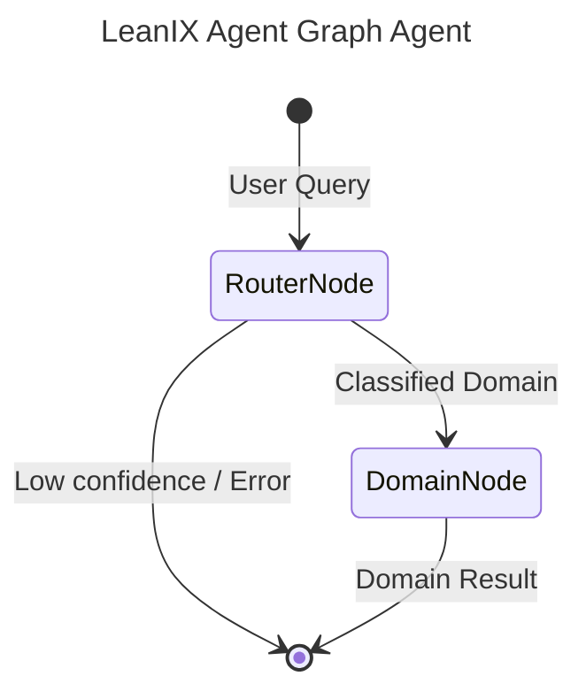

# LeanIX Agent - A2A | AG-UI | MCP


*Version: 0.11.1*

## Overview

**LeanIX Agent MCP Server + A2A Agent**

Agent package for communicating with LeanIX Enterprise Architecture Management via REST APIs and GraphQL.

This repository is actively maintained - Contributions are welcome!

## Features

### Core Capabilities
- **FactSheet Management**: Create, read, update FactSheets (Applications, Components, etc.)
- **GraphQL Queries**: Execute flexible GraphQL queries with variables and operations
- **Metrics & KPIs**: Access custom metrics, KPIs, and performance data
- **Discovery Integration**: SaaS, SAP, and AI agent discovery services
- **Architecture Relations**: Query FactSheet relationships and hierarchies
- **User & Workspace Management**: Manage users, permissions, and workspace settings
- **Authentication**: Automatic OAuth token management and session handling

### API Coverage
The agent provides access to 30+ LeanIX API services with 500+ methods:
- **Pathfinder API**: FactSheet operations, relations, and resource models
- **Metrics API**: Schema management, KPI tracking, and data points
- **MTM API**: Account management, workspace administration, and OAuth
- **Discovery APIs**: SaaS, SAP, and AI agent discovery
- **Integration APIs**: Collibra, ServiceNow, and Signavio connectors
- **Support APIs**: Documents, impacts, navigation, polls, and webhooks


## MCP

### Using as an MCP Server

The MCP Server can be run in two modes: `stdio` (for local testing) or `http` (for networked access).

#### Environment Variables

*   `LEANIX_WORKSPACE`: The URL of the target service.
*   `LEANIX_API_TOKEN`: The API token or access token.

#### Run in stdio mode (default):
```bash
export LEANIX_WORKSPACE="http://localhost:8080"
export LEANIX_API_TOKEN="your_token"
leanix-mcp --transport "stdio"
```

#### Run in HTTP mode:
```bash
export LEANIX_WORKSPACE="http://localhost:8080"
export LEANIX_API_TOKEN="your_token"
leanix-mcp --transport "http" --host "0.0.0.0" --port "8000"
```

## A2A Agent

### Run A2A Server
```bash
export LEANIX_WORKSPACE="http://localhost:8080"
export LEANIX_API_TOKEN="your_token"
leanix-agent --provider openai --model-id gpt-4o --api-key sk-...
```

## Security & Governance

This project is built on [`agent-utilities`](https://github.com/Knuckles-Team/agent-utilities), inheriting enterprise-grade security and governance features.

### Authentication & Authorization
| Feature | Description |
|---------|-------------|
| **OIDC Token Delegation** | RFC 8693 token exchange for user-context propagation from A2A → MCP |
| **Eunomia Policies** | Fine-grained, policy-driven tool authorization (`none`, `embedded`, `remote`) |
| **Scoped Credentials** | Tools execute with the caller's scoped identity where possible |
| **3LO / OAuth / API Token** | Multiple auth strategies with graceful fallback |

### Eunomia Policy Enforcement
Eunomia provides a policy enforcement point for all tool calls:
- **Embedded mode**: Load local `mcp_policies.json` for role-based access, sensitivity gating, and audit logging
- **Remote mode**: Forward authorization decisions to a central Eunomia policy server for multi-agent governance
- Enable via CLI: `--eunomia-type embedded --eunomia-policy-file mcp_policies.json`

### Runtime Protections
| Protection | Description |
|------------|-------------|
| **Tool Guard** | Sensitivity detection with human-in-the-loop approval gating |
| **Prompt Injection Defense** | Input scanning and repetition/loop guards |
| **Content Filtering** | Output schema enforcement and cost budget controls |
| **Stuck Loop Detection** | Automatic detection and recovery from agent loops |
| **Context Limit Warnings** | Proactive alerts before context window exhaustion |

### Graph Agent Architecture
The A2A agent uses `pydantic-graph` orchestration with:
- **RouterNode**: Lightweight classifier that routes queries to specialized domains
- **DomainNode**: Focused executor with only relevant tools loaded, preventing tool hallucination
- **Approval Gates**: Policy-driven approval workflows before sensitive operations
- **Usage Guards**: Budget and rate limiting enforcement

> **Production Recommendation**: Enable `--eunomia-type embedded` (or `remote`) + OIDC delegation + containerized deployment. See [`agent-utilities` documentation](https://github.com/Knuckles-Team/agent-utilities) for full policy configuration.

## Docker

### Build

```bash
docker build -t leanix-agent .
```

### Run MCP Server

```bash
docker run -d \
  --name leanix-agent \
  -p 8000:8000 \
  -e TRANSPORT=http \
  -e LEANIX_WORKSPACE="http://your-service:8080" \
  -e LEANIX_API_TOKEN="your_token" \
  knucklessg1/leanix-agent:latest
```

### Deploy with Docker Compose

```yaml
services:
  leanix-agent:
    image: knucklessg1/leanix-agent:latest
    environment:
      - HOST=0.0.0.0
      - PORT=8000
      - TRANSPORT=http
      - LEANIX_WORKSPACE=http://your-service:8080
      - LEANIX_API_TOKEN=your_token
    ports:
      - 8000:8000
```

#### Configure `mcp.json` for AI Integration (e.g. Claude Desktop)

```json
{
  "mcpServers": {
    "leanix": {
      "command": "uv",
      "args": [
        "run",
        "--with",
        "leanix-agent",
        "leanix-mcp"
      ],
      "env": {
        "LEANIX_WORKSPACE": "http://your-service:8080",
        "LEANIX_API_TOKEN": "your_token"
      }
    }
  }
}
```

## Install Python Package

```bash
python -m pip install leanix-agent
```
```bash
uv pip install leanix-agent
```

## Repository Owners


## Graph Architecture

This agent uses `pydantic-graph` orchestration for intelligent routing and optimal context management.



- **RouterNode**: A fast, lightweight LLM (e.g., `nvidia/nemotron-3-super`) that classifies the user's query into one of the specialized domains.
- **DomainNode**: The executor node. For the selected domain, it dynamically sets environment variables to temporarily enable ONLY the tools relevant to that domain, creating a highly focused sub-agent (e.g., `gpt-4o`) to complete the request. This preserves LLM context and prevents tool hallucination.


## MCP Configuration Examples

### stdio (recommended for local development)
```json
{
  "mcpServers": {
    "leanix": {
      "command": ".venv/bin/leanix-mcp",
      "args": [],
      "env": {
        "LEANIX_WORKSPACE": "",
        "LEANIX_API_TOKEN": ""
}
    }
  }
}
```

### Streamable HTTP (recommended for production)
```json
{
  "mcpServers": {
    "leanix": {
      "url": "http://localhost:8080/leanix-mcp/mcp"
    }
  }
}
```
